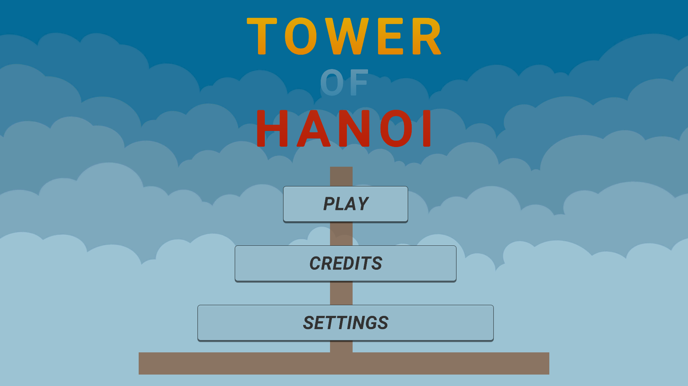
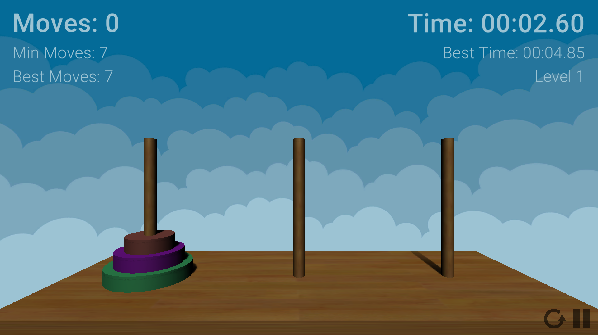

# Tower Of Hanoi Game
Tower of Hanoi is a mathematical game or puzzle. It consists of three rods and a stack of disks arranged from largest on the bottom to smallest on top. The goal of the game is to move the entire stack to another rod obeying 3 simple rules:
<ul>
  <li>Only one disk can be moved at a time</li>
  <li>Each move consists of moving the uppermost disk from one</li>
  <li>No disk may be placed on a smaller disk</li>
</ul>

The game was developed using Unity3D and C# language. The target platform was the web browser.

The game is currently being hosted on <a>https://tower-of-hanoi.up.railway.app/</a>

Unity version <i>2020.1.1f1</i> was used.

<h2> Credits </h2>
<ul>
  <li>The button icons were obtained from <a>www.flaticon.com</a>.</li>
  <li>The sound effects were obtained from <a>www.zapsplat.com</a>.</li>
  <li>Some assets (wood texture, and skybox) were downloaded from the Unity store.</li> 
</ul>
